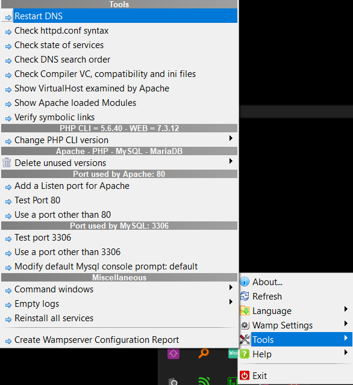

# Example of a login page

This example demonstrates how to create a login page with PHP and MySQL.
The project includes examples of an MVC architecture (Model-View-Controller).
By following the MVC architecture, the project is divided into three main folders:
* `controller`: contains the controllers of the project (flow of the application)
* `model`: contains the models of the project (data of the application)
* `view`: contains the views of the project (display of the application)

## Installation

### Virtual Host

* Open WAMP server
* Visit `localhost` in your browser (or right-click on the WAMP icon and click on `localhost`)
* Click on `Add a Virtual Host`
* Set the `Project Root` to the project folder
* Set the `Virtual Host Name` to `tai`
* Click on `Start the creation of the Virtual Host`
* Right-click on the WAMP icon, select `Tools` and click on `Restart DNS`

 "DNS location"

### Project

* Download the project
* Extract the project in the `www` folder of WAMP (or the folder you set as `Project Root` in the Virtual Host creation)

### Database:

* Open PhpMyAdmin
* Create a database named `tai`
* Import the file `user.sql` from the project/sql folder

You can now visit the project at `tai` (or the name you set as `Virtual Host Name` in the Virtual Host creation)
Try to login with the following credentials:
|First Name|Last name|Login|Password|
|:----------:|:---------:|:-----:|:--------:|
|Homer|Simpson|donut|123|
|Marge|Simpson|marge|revelation|
|Bart|Simpson|el barto|EatMyShorts|
|Lisa|Simpson|lisa_simpson|Th*s_is_a_diffiCULT_pw8|

## To Note

1. For the **model**, the project provides an example of class and subclass to interact with the database. This will prevent you from re-writing the same code over and over again. You can find the classes in the `model` folder.
1. For the **view**, the project provides an example of an include file to prevent you from re-writing the same code over and over again. You can find the include file in the `view` folder.
1. The code is **commented** to help you understand how it works. 

> Your project should follow the same architecture, as well as the same coding style (indentation, comments, etc.).

# MVC Architecture

